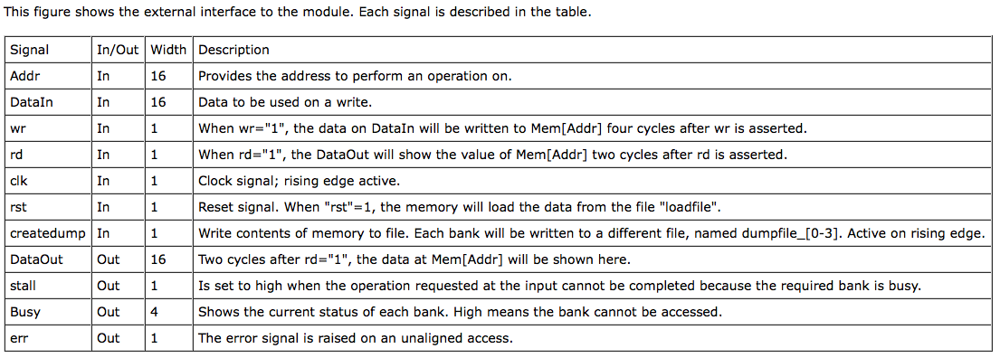
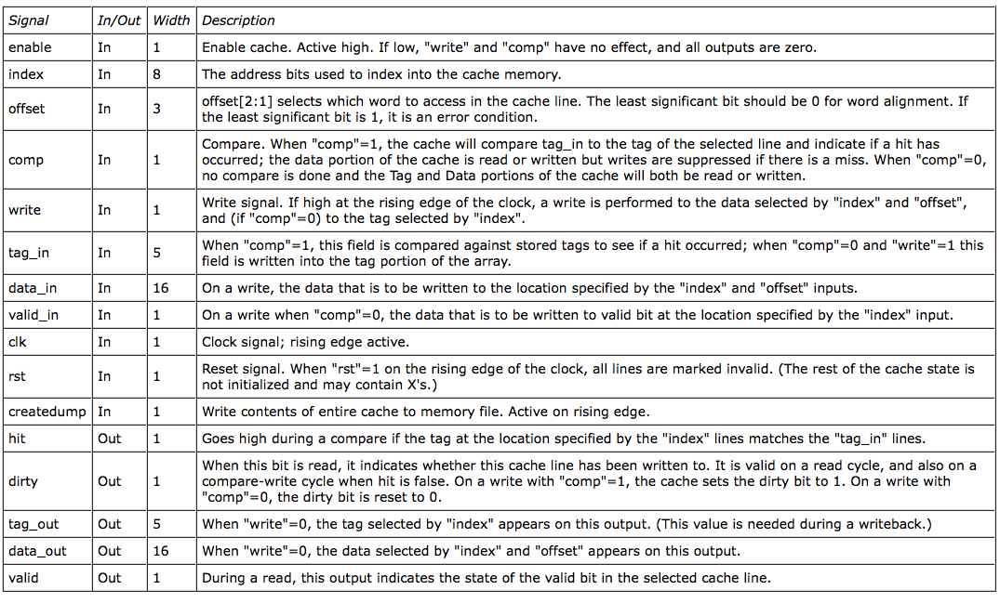

# Direct Mapped Cache


## Author: 
[Xuyi Ruan](https://github.com/ruanxuyi)  
[Yudong Sun](https://github.com/Suncuss)


## Description

[Cache Design Page](http://pages.cs.wisc.edu/~karu/courses/cs552/spring2016/wiki/index.php/Main/CacheDesign)

Your final processor you design for this course will use both instruction and data caches. For this stage of the project you will be designing and testing a cache to ultimately be used for your final design. You must first design and verify a direct mapped cache before making changes to create a two-way set-associative cache.  
The cache's storage as well as the memory has already been designed for you. You will be implementing the memory system controller to effectively manage the cache.


## Four-banked Memory Module

                        +-------------------+
                        |                   |
      Addr[15:0] >------|   four_bank_mem   |
    DataIn[15:0] >------|                   |
              wr >------|    64KB           |-----> DataOut[15:0]
              rd >------|                   |-----> stall
                        |                   |-----> Busy[3:0]
             clk >------|                   |-----> err
             rst >------|                   |
      createdump >------|                   |
                        +-------------------+


Timing:
    |            |            |            |            |            |
    | addr       | addr etc   | read data  |            | new addr   |
    | data_in    | OK to any  | available  |            | etc. is    |
    | wr, rd     |*diffferent*|            |            | OK to      |
    | enable     | bank       |            |            | *same*     |
    |            |            |            |            | bank       |
                  <----bank busy; any new request to--->
                       the *same* bank will stall




This is a byte-aligned, word-addressable 16-bit wide 64K-byte memory.  

Requests may be presented every cycle. They will be directed to one of the four banks depending on the least significant 2 bits of the address.  

Two requests to the same bank which are closer than cycles N and N+4 will result in the second request not happening, and a "stall" output being generated.  

Busy output reflects the current status of each individual bank.  

Concurrent read and write not allowed.  

On reset, memory loads from file "loadfile_0.img", "loadfile_1.img", "loadfile_2.img", and "loadfile_3.img". Each file supplies every fourth word. (The latest version of the assembler generates these four files.)  

 Format of each file:  
     @0 
     <hex data 0>
     <hex data 1>
     ...etc  
     
If input "create_dump" is true on rising clock, contents of memory will be dumped to file "dumpfile_0", "dumpfile_1", etc. Each file will be a dump from location 0 up through the highest location modified by a write in that bank.  


## Cache Interface and Organization

This figure shows the external interface to the module. Each signal is described in the table below.
                         +-------------------+
                         |                   |
           enable >------|                   |
       index[7:0] >------|    cache          |
      offset[2:0] >------|                   |
             comp >------|    256 lines      |-----> hit
            write >------|    by 4 words     |-----> dirty
      tag_in[4:0] >------|                   |-----> tag_out[4:0]
    data_in[15:0] >------|                   |-----> data_out[15:0]
         valid_in >------|                   |-----> valid
                         |                   |
              clk >------|                   |
              rst >------|                   |-----> err
       createdump >------|                   |
                         +-------------------+




The cache contains 256 lines. Each line contains one valid bit, one dirty bit, a 5-bit tag, and four 16-bit words:


## State Machine


You will need to determine how your cache is arranged and functions before starting implementation. Draw out the state machine for your cache controller as this will be required. You may implement either a Mealy or Moore machine though a Moore machine is recommended as it will likely be easier. Be forewarned that the resulting state machine will be relatively large so it is best to start early.  

## Control signals


Although there are a lot of signals for the cache, its operation is pretty simple. When "enable" is high, the two main control lines are "comp" and "write". Here are the four cases for the behavior of the direct mapped cache:  

###Compare Read (comp = 1, write = 0)  
This case is used when the processor executes a load instruction. The "tag_in", "index", and "offset" signals need to be valid. Either a hit or a miss will occur, as indicated by the "hit" output during the same cycle. If a hit occurs, "data_out" will contain the data and "valid" will indicate if the data is valid. If a miss occurs, the "valid" output will indicate whether the block occupying that line of the cache is valid. The "dirty" output indicates the state of the dirty bit in the cache line.  
###Compare Write (comp = 1, write = 1)  
This case occurs when the processor executes a store instruction. The "data_in", "tag_in", "index", and "offset" lines need to be valid. Either a hit or a miss will occur as indicated by the "hit" output during the same cycle. If there is a miss, the cache state will not be modified. If there is a hit, the word will be written at the rising edge of the clock, and the dirty bit of the cache line will be written to "1". (The "dirty" output is not meaningful as this is a write cycle for that bit.) NOTE: On a hit, you also need to look at the "valid" output! If there is a hit, but the line is not valid, you should treat it as a miss; the other word of the line will not be valid and you will not want to leave the cache in that state.  
On a miss, the "valid" output will indicate whether the block occupying that line of the cache is valid. The dirty bit will be read, and will indicate whether or not the block occupying that line is dirty. On the other hand, if "hit" is true while "write" and "comp" are true, "dirty" output is not meaningful and will remain zero (because the dirty bit of the cache was performing a write).  
###Access Read (comp = 0, write = 0)  
This case occurs when you want to read the tag and the data out of the cache memory. You will need to do this when a cache line is victimized, to see if the cache line is dirty and to write it back to memory if necessary. With "comp"=0, the cache basically acts like a RAM. The "index" and "offset" inputs need to be valid to select what to read. The "data_out", "tag_out", "valid", and "dirty" outputs will be valid during the same cycle.  
###Access Write (comp = 0, write = 1)  
This case occurs when you bring in data from memory and need to store it in the cache. The "index", "offset", "tag_in", "valid_in" and "data_in" signals need to be valid. On the rising edge of the clock, the values will be written into the specified cache line. Also, the dirty bit will be set to zero.  


[FSM diagram](cache-direct-final-version.pdf) 


## Testing

### Perfbench

The perfbench testbench uses address trace files that describe a sequence of reads and writes. You will need to write several (at least 5) address traces to test your cache and the various behavior cases that might occur. You should try to make it so that your traces highlight the various use cases that your cache might experience to be sure that they are working.  
An example address trace file (mem.addr) is provided. The format of the file is the following:  
Each line represents a new request  
Each line has 4 numbers separated by a space  
The numbers are: Wr Rd Addr Value  

Once you have created your address traces this testbench can be run as such:  

```
wsrun.pl -addr mem.addr mem_system_perfbench *.v
```
If it correctly runs you will get output that looks like the following:  

```
# Using trace file   mem.addr
# LOG: ReQNum    1 Cycle       12 ReqCycle        3 Wr Addr 0x015c Value 0x0018 ValueRef 0x0018 HIT 0
#
# LOG: ReqNum    2 Cycle       14 ReqCycle       12 Rd Addr 0x015c Value 0x0018 ValueRef 0x0018 HIT 1
#
# LOG: Done all Requests:          2 Replies:          2 Cycles:         14 Hits:          1
# Test status: SUCCESS
# Break at mem_system_perfbench.v line 200
# Stopped at mem_system_perfbench.v line 200
```

Be aware that just because a SUCCESS message is received it does not guarantee your cache is working correctly. You should use the cache simulator to verify the correct behavior is happening. The cache simulator can be run as follows:

```    
cachesim <associativity> <size_bytes> <block_size_bytes> <trace_file>
```

So for this problem you would use:

```
cachesim 1 2048 8 mem.addr
```

This will generate output like the following:

```
    Store Miss for Address 348
Load Hit for Address 348
```


### Randbench 

Once you are confident that your design is working you should test it using the random testbench. The random bench does the following:  
- full random: 1000 memory requests completely random  
- small random: 1000 memory requests restricted to addresses 0 to 2046  
- sequential addresss: 1000 memory requests restricted to address 0x08, 0x10, 0x18, 0x20, 0x28, 0x30, 0x38, 0x40  
- two sets address: 1000 memory requests to test a two-way set associative cache. You should get predominantly hits to to the cache.  

You can run the random testbench like this:

```
wsrun.pl mem_system_randbench *.v
```


## Issues: 
1. Error: (vsim-3601) Iteration limit reached at time 1201 ns.  

This exception was raised by VSIM, the cause of the exception is the FSM goes into a state whose `nextState = xxxx` where belong to no where. The unexpect behavior was caused by one of the state condition with no input match to specified case, therefore enter defult case, whose nextState was design to be `xxxx` to catch this kind of internal bug. 

 
details: 
```
        
        casex({Wr,Rd,valid,hit,dirty,stall,state})
            
            // changed from 
            10'bxx110x_0010: if it is hit, dont care about dirty.
            // to below
            10'bxx11xx_0010:
```

## References: 
[Synthesis Page](http://pages.cs.wisc.edu/~karu/courses/cs552/spring2016//wiki/index.php/Synthesis/Synthesis)
